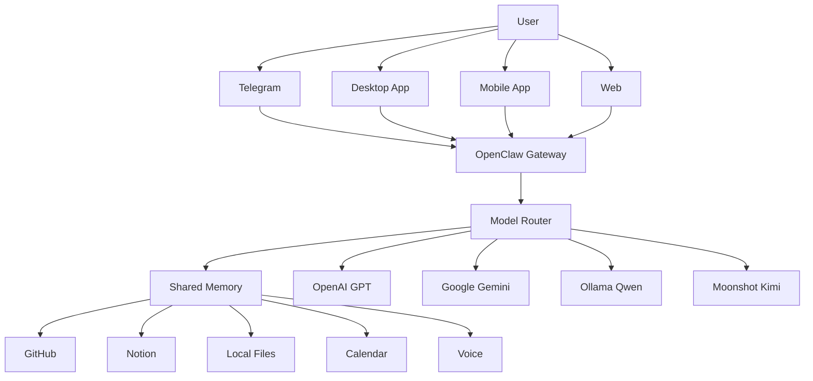

# ClawIQ Architecture

> One AI. Many Brains.

---

# Overview

ClawIQ is designed as an AI orchestration platform rather than a single chatbot.

Instead of relying on one language model, ClawIQ coordinates multiple AI providers, local models, tools and memory through a single intelligent router.

The user interacts with one assistant while ClawIQ decides which model and tools should solve the task.

---

# High-Level Architecture



---

# Core Components

## User Interfaces

Current

- Telegram

Planned

- Desktop
- Android
- iPhone
- Web

---

## Gateway

Responsibilities:

- Receive messages
- Manage sessions
- Handle channels
- Route requests

Technology:

- OpenClaw Gateway

---

## Model Router

The Router is the brain of ClawIQ.

Responsibilities:

- Select the best AI model
- Manage fallbacks
- Reduce costs
- Optimize context usage

Current routing:

GPT → Qwen

Future routing:

GPT

↓

Gemini

↓

Kimi

↓

Qwen

---

## Shared Memory

One memory shared across every interface.

Responsibilities:

- User preferences
- Project memory
- Long-term memory
- Conversation history

Future:

Semantic search

---

## AI Providers

### OpenAI

Primary reasoning model.

---

### Gemini

Large context.

Research.

Documents.

---

### Kimi

Coding.

Reasoning.

Cost optimization.

---

### Ollama

Offline inference.

Privacy.

Local execution.

---

## Integrations

Current

- Telegram
- GitHub
- Notion

Planned

- Gmail
- Calendar
- Google Drive
- Local Files

---

# Long-Term Vision

Future architecture

```text
User

↓

ClawIQ

↓

Router

↓

Multiple AI Providers

↓

Shared Memory

↓

External Tools

↓

Automations
```

---

# Design Principles

- Modular
- Provider agnostic
- Local-first
- Privacy-friendly
- Extensible
- Fault tolerant

---

# Current Status

Implemented

- Gateway
- Telegram
- GPT
- Ollama
- Local fallback

In Progress

- Gemini
- Vision
- Router

Planned

- Multi-agent system
- Desktop application
- Mobile applications
- Voice
- Memory
